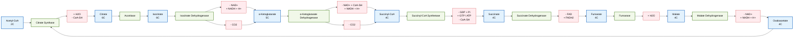

# Krebs Cycle

```mermaid
flowchart LR
    %% Style Definitions
    classDef substrate fill:#e3f2fd,stroke:#1565c0,stroke-width:2px,color:#000;
    classDef enzyme fill:#f1f8e9,stroke:#558b2f,stroke-width:2px,style:italic,color:#000;
    classDef byproduct fill:#ffebee,stroke:#c62828,stroke-width:1px,color:#000;

    %% Nodes
    Acetyl[Acetyl-CoA <br/> 2C]:::substrate
    OAA[Oxaloacetate <br/> 4C]:::substrate
    Citrate[Citrate <br/> 6C]:::substrate
    Isocitrate[Isocitrate <br/> 6C]:::substrate
    AlphaKG[α-Ketoglutarate <br/> 5C]:::substrate
    Succinyl[Succinyl-CoA <br/> 4C]:::substrate
    Succinate[Succinate <br/> 4C]:::substrate
    Fumarate[Fumarate <br/> 4C]:::substrate
    Malate[Malate <br/> 4C]:::substrate

    %% Enzymes
    E1[Citrate Synthase]:::enzyme
    E2[Aconitase]:::enzyme
    E3[Isocitrate Dehydrogenase]:::enzyme
    E4[α-Ketoglutarate Dehydrogenase]:::enzyme
    E5[Succinyl-CoA Synthetase]:::enzyme
    E6[Succinate Dehydrogenase]:::enzyme
    E7[Fumarase]:::enzyme
    E8[Malate Dehydrogenase]:::enzyme

    %% Byproducts
    B1[+ H2O <br/> - CoA-SH]:::byproduct
    B2_1[- NAD+ <br/> + NADH + H+]:::byproduct
    B2_2[- CO2]:::byproduct
    B3_1[- NAD+ + CoA-SH <br/> + NADH + H+]:::byproduct
    B3_2[- CO2]:::byproduct
    B4[- GDP + Pi <br/> + GTP / ATP <br/> - CoA-SH]:::byproduct
    B5[- FAD <br/> + FADH2]:::byproduct
    B6[+ H2O]:::byproduct
    B7[- NAD+ <br/> + NADH + H+]:::byproduct

    %% Flow / Connections
    OAA --> E1
    Acetyl --> E1
    E1 --> B1 --> Citrate
    
    Citrate --> E2 --> Isocitrate
    
    Isocitrate --> E3
    E3 --> B2_1 & B2_2 --> AlphaKG
    
    AlphaKG --> E4
    E4 --> B3_1 & B3_2 --> Succinyl
    
    Succinyl --> E5
    E5 --> B4 --> Succinate
    
    Succinate --> E6
    E6 --> B5 --> Fumarate
    
    Fumarate --> E7
    E7 --> B6 --> Malate
    
    Malate --> E8
    E8 --> B7 --> OAA

```
